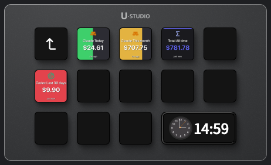

# AI Cost Monitor — UlanziDeck Plugin

See how much you're spending on AI coding tools — right on your desk.

One button per platform. Real dollar amounts. No API keys.



---

## Install

```bash
/bin/bash -c "$(curl -fsSL https://raw.githubusercontent.com/narlei/ulanzideck-ai-cost/main/install.sh)"
```

Requires macOS and [Ulanzi Studio](https://www.ulanzi.com/pages/download) already installed.

> **Node.js ≥ 22 required** — the plugin reads your local AI session files using [codeburn](https://github.com/getagentseal/codeburn). If you use Claude Code, Codex, or Cursor you almost certainly have it. Check with `node --version`. Install via `brew install node` if needed.

---

## What it does

Drag a button to your deck, open the property inspector, and configure:

| Setting | Options | Default |
|---|---|---|
| **Platform** | Claude, Codex, Cursor, Gemini, Copilot, Total, and 6 others | Claude |
| **Period** | Today, Last 7 days, This month, Last 30 days, All time | Today |
| **Limit (USD)** | Any dollar amount — `0` = no limit | 0 (off) |

**Without a limit** — the button shows the cost value in your platform's brand color on a dark background.

**With a limit** — the background becomes a progress bar that fills as you spend. Colors shift from green → yellow → orange → red as you approach the limit.

Click any button to force an immediate refresh. Data is collected every 15 minutes in the background — one scan feeds all your buttons.

---

## Setup

The plugin reads cost data locally from your AI tools' session files. No accounts, no API keys, no internet connection needed for cost data.

What each platform needs on disk:

| Platform | Where codeburn reads from |
|---|---|
| Claude Code | `~/.claude/projects/` |
| Codex | `~/.codex/sessions/` |
| Cursor | Cursor's local SQLite database |
| Gemini | `~/.gemini/` |
| Copilot | VS Code extension data |

If a platform hasn't been used, its button shows `—` (no data). That's expected.

### Node.js not found?

The plugin spawns a child `node` process to run codeburn. If you see a ⚠ Setup button, click it — it opens this guide. Then verify:

```bash
# check version (need ≥ 22)
node --version

# install or upgrade via Homebrew
brew install node
```

The plugin probes `/opt/homebrew/bin/node`, `/usr/local/bin/node`, and `/usr/bin/node` automatically — no PATH configuration needed.

---

## Manual install / development

```bash
git clone https://github.com/narlei/ulanzideck-ai-cost
cd ulanzideck-ai-cost
make install   # installs deps + syncs to UlanziDeck + restarts Ulanzi Studio
```

Other make targets:

```bash
make package      # build distributable ZIP → dist/
make sync         # sync files without restarting
make restart      # restart Ulanzi Studio only
make bump_patch   # bump version (patch/minor/major)
```

---

## Credits

Cost calculation is powered by the open-source **[codeburn](https://github.com/getagentseal/codeburn)** (MIT) — a CLI that reads AI session files and calculates spend using LiteLLM pricing data. AI Cost Monitor embeds codeburn as a dependency; it is an independent plugin by Narlei Moreira.

See [THIRD_PARTY_LICENSES.md](THIRD_PARTY_LICENSES.md) for the full codeburn license text.

---

## License

MIT © Narlei Moreira
