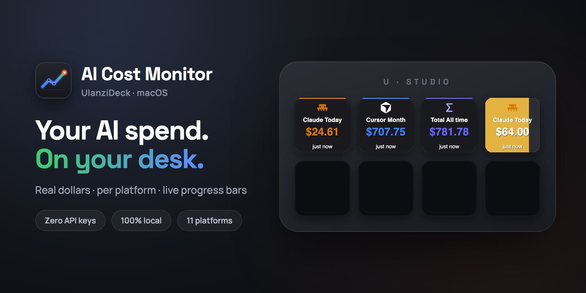

# AI Cost Monitor

**See exactly what you're spending on AI coding tools — on your physical desk.**

Real dollar amounts. Per platform. Live progress bars. Zero API keys.



[](LICENSE)
[]()
[]()
[]()

---

## Why this exists

You open Claude Code, Cursor, or Codex and just... start coding. Hours later you wonder: *how much did that session cost me?*

AI Cost Monitor puts the answer on a physical button in front of you — always visible, no app switching, no dashboards.

---

## Install

```bash
/bin/bash -c "$(curl -fsSL https://raw.githubusercontent.com/narlei/ulanzideck-ai-cost/main/install.sh)"
```

> **Requirements:** macOS · [Ulanzi Studio](https://www.ulanzi.com/pages/download) · Node.js ≥ 22

That's it. One command, no configuration files, no API keys.

---

## How it works

Drag a button to your deck → open the property inspector → pick a platform and time period.

| Setting | Options |
|---|---|
| **Platform** | Claude, Codex, Cursor, Gemini, Copilot, Total, and 6 others |
| **Period** | Today · Last 7 days · This month · Last 30 days · All time |
| **Spend limit** | Any dollar amount — leave at `0` to disable |

### Without a limit

The button shows your current spend in the platform's brand color on a dark background.

### With a limit — the button becomes a progress bar

The background fills as you spend. Colors shift automatically:

```
0% ──── 50% ──── 75% ──── 90% ──── 100%
🟢 green  🟡 yellow  🟠 orange  🔴 red
```

Click any button to force an immediate refresh. The plugin scans in the background every 15 minutes — one scan feeds all your buttons.

---

## Privacy

All cost data is read **locally** from your AI tools' session files. Nothing leaves your machine.

| Platform | Where data comes from |
|---|---|
| Claude Code | `~/.claude/projects/` |
| Codex | `~/.codex/sessions/` |
| Cursor | Cursor's local SQLite database |
| Gemini | `~/.gemini/` |
| Copilot | VS Code extension data |

If a platform hasn't been used yet, its button shows `—`. That's expected.

---

## Troubleshooting

**⚠ Setup button appears on your deck**

The plugin couldn't find Node.js. Click the button — it opens this guide. Then:

```bash
node --version        # needs to be v22 or higher
brew install node     # install or upgrade via Homebrew
```

The plugin probes `/opt/homebrew/bin/node`, `/usr/local/bin/node`, and `/usr/bin/node` automatically — no PATH changes needed.

---

## Development

```bash
git clone https://github.com/narlei/ulanzideck-ai-cost
cd ulanzideck-ai-cost
make install   # install deps + sync to UlanziDeck + restart Ulanzi Studio
```

Other targets:

| Command | What it does |
|---|---|
| `make package` | Build distributable ZIP → `dist/` |
| `make sync` | Sync files without restarting |
| `make restart` | Restart Ulanzi Studio only |
| `make bump_patch` | Bump version (patch / minor / major) |

---

## Credits

Cost calculation is powered by **[codeburn](https://github.com/getagentseal/codeburn)** (MIT) — an open-source CLI that reads AI session files and calculates spend using LiteLLM pricing data.

AI Cost Monitor embeds codeburn as a dependency and is an independent plugin by [Narlei Moreira](https://github.com/narlei).

See [THIRD_PARTY_LICENSES.md](THIRD_PARTY_LICENSES.md) for the full license text.

---

MIT © Narlei Moreira
